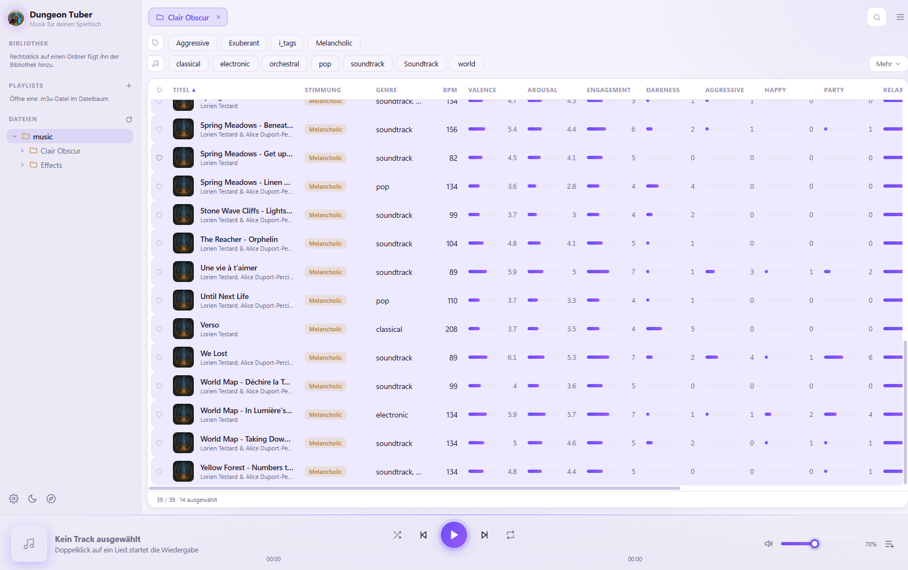

# DungeonTuber

[](https://github.com/gandulf/DungeonTuber/blob/master/README.md)
[](https://github.com/gandulf/DungeonTuber/blob/master/README.de.md)
[](https://github.com/gandulf/DungeonTuber/actions/workflows/build-app.yml)
[](https://github.com/gandulf/DungeonTuber/actions/workflows/release-app.yml)

[](https://opensource.org/licenses/MIT)

**DungeonTuber** ist ein selbst gehosteter Musikplayer für Rollenspiel-Spielleiter (GMs), Streamer und Geschichtenerzähler, die die perfekte Atmosphäre sofort griffbereit brauchen. Er läuft als kleiner Webserver (ein Docker-Container auf einem NAS, einem Raspberry Pi oder einer günstigen Cloud-VM) und spielt deine Musik **im Browser** auf jedem Gerät ab: Laptop, Tablet oder Handy am Spieltisch. Im Gegensatz zu Standard-Playern ermöglicht DungeonTuber die Kategorisierung und Filterung deiner Musik nach emotionalem Gewicht, Intensität, Tempo und genre-spezifischen Metadaten und kann während des Spiels deine Lampen steuern.
 


---

## 🚀 Hauptmerkmale

* **Web-App auf jedem Gerät:** Öffne die Serveradresse im Browser; die Wiedergabe passiert im Browser (Überblenden zwischen Songs, normalisierte Lautstärke).
* **Stimmungsfilter:** Eine Mood-Map (Valence/Arousal), **anpassbare Kategorie-Regler**, BPM, Genre und Schnell-Tag-Filter (*Kampf*, *Reise*, *Magisches Ritual*, ...) grenzen eine große Bibliothek in Sekunden auf den passenden Song ein. Speichere eine Kombination als Preset.
* **Bibliothek mit Scores und Tags:** Songs zeigen Scores, Tags, Genres, BPM, Cover und Kapitel in einer übersichtlichen Tabelle. Alles steckt in den mp3-Tags, deine Dateien bleiben also portabel.
* **Playlists und Favoriten:** Erstelle `.m3u`-Playlists, fülle sie per Drag & Drop und markiere Favoriten mit einem Stern.
* **Effekt-Rack:** Lege Hintergrundeffekte (Regen, Lagerfeuer, ...) über die Musik; sie laufen unabhängig vom Hauptplayer.
* **Smarte Lichter:** Steuere **WiZ**-Lampen über einen Song oder ein Kapitel, auch wenn der Server in der Cloud läuft (siehe Licht-Agent unten).
* **KI-Analyse:** Der **Voxalyzer**-Agent analysiert deine Songs auf einem Rechner mit den Modellen (eine GPU wird empfohlen) und schreibt Kategorien, Tags, Genres und BPM in die Bibliothek.
* **Mehrere Benutzer:** Der Administrator legt Benutzer mit eigenem Namen und Passwort an; Uploads werden dem Hochladenden zugeordnet.
* **Lokale Ordner oder S3:** Die Musik liegt auf der Festplatte des Servers oder in einem S3-kompatiblen Bucket (AWS S3, Cloudflare R2, Backblaze B2, MinIO, ...).
* **Deutsch und Englisch, helles und dunkles Design.**

---

## 🌐 Schnellstart

Am einfachsten geht es mit dem Docker-Image:

```bash
docker run -d -p 8765:8765 -e DT_PASSWORD=aendern \
  -v /pfad/zur/musik:/music -v dungeontuber-data:/data ghcr.io/gandulf/dungeontuber
```

Öffne `http://<server>:8765` und melde dich als `admin` mit dem gesetzten Passwort an. Ziehe mp3-Dateien oder Ordner auf den Dateibaum, um sie hochzuladen, oder kopiere sie in den Musikordner und wähle im Menü *Bibliothek neu einlesen*.

Für den Zugriff über das Internet nutze [`deploy/docker-compose.yml`](deploy/docker-compose.yml) (automatisches HTTPS mit Caddy) oder folge der Schritt-für-Schritt-Anleitung für eine kostenlose Oracle-Cloud-VM mit DuckDNS-Namen: [`deploy/oracle`](deploy/oracle/README.md). Details zu allen Varianten stehen unter [Installation & Betrieb](#-installation--betrieb).

---

## 📖 Tutorial: So benutzt du DungeonTuber

### 1. Bibliothek aufbauen
* **Hochladen:** Ziehe mp3-Dateien oder ganze Ordner auf den Dateibaum, oder nutze *Lieder hochladen…* im Menü oder im Kontextmenü eines Ordners. Ordnerstrukturen bleiben erhalten.
* **Vorhandene Musik:** Kopiere Dateien in den Bibliotheksordner des Servers (oder füge unter **Einstellungen → Bibliothek** einen S3-Bucket hinzu) und wähle *Bibliothek neu einlesen*.
* **Analyse:** Ist ein Voxalyzer-Agent verbunden (siehe [Agenten](#-agenten)), wähle *Analysieren* bei einem Song oder Ordner. Ohne Agent sind die Analyse-Funktionen deaktiviert.

### 2. Nach Stimmung filtern
Die Stärke von DungeonTuber liegt im Filterbereich über der Song-Tabelle:
* **Mood-Map:** Ziehe den blauen Punkt in Richtung *Wütend/Aufgeregt* für einen Bosskampf oder *Glücklich/Entspannt* für ein friedliches Stadtthema.
* **Kategorie-Regler:** Verfeinere die Suche (z. B. *Mystik* und *Dunkelheit* erhöhen für einen gruseligen Dungeon); die Liste filtert automatisch.
* **BPM:** Passe den Herzschlag der Szene an, z. B. hohe BPM für eine Verfolgungsjagd.
* **Tags und Genres:** Ein-Klick-Filter wie **Drums** oder **Düster**. Ziehe einen Tag auf einen Song, um ihn zu taggen.
* **Presets:** Gib einen Namen ein (z. B. *Epischer Boss*), klicke auf das Speichern-Symbol und rufe den Filter später aus dem Dropdown wieder auf.

### 3. Wiedergabe & Effekte
* **Abspielen:** Doppelklicke einen Song oder nutze die Player-Leiste (auch `Strg`+`P` Abspielen/Pause, `Strg`+`N` weiter, `Strg`+`B` zurück). Songs werden überblendet und mit normalisierter Lautstärke abgespielt (einstellbar unter **Einstellungen → Player**).
* **Shuffle & Wiederholen:** Shuffle spielt die aktuell gefilterte Auswahl zufällig ab.
* **Kapitel und Licht:** Songs können Kapitel haben, und ein Song oder Kapitel kann eine eigene Lichteinstellung tragen.
* **Effekte:** Öffne im Effekt-Rack einen Ordner mit Effekt-Sounds und klicke auf einen Effekt, um ihn zu starten. Effekte laufen neben der Musik, z. B. *Regen* unter einem *Tavernen*-Song.
* **Layout:** Über das Ansicht-Menü blendest du Widgets aus, die du nicht brauchst, sodass ein kleiner Bildschirm nur die Trackliste zeigen kann.

### 4. Suche, Favoriten & Playlists
* **Suche:** Tippe einfach los, um die Song-Tabelle oder den Verzeichnisbaum zu filtern.
* **Favoriten:** Klicke auf den **Stern** neben einem Track. Favorisierte Ordner erscheinen in der Seitenleiste.
* **Playlists:** *Neue Playlist…* erstellt eine `.m3u`-Datei im Ordner deiner Wahl; füge Songs über das Kontextmenü oder per Drag & Drop hinzu.

---

## 🤖 Agenten

Agenten sind kleine Programme auf anderen Rechnern, die sich nach außen mit deinem Server verbinden, sodass der Server selbst überall laufen kann. Den Agenten-Token erstellst du unter **Einstellungen → Agenten** (Administrator); er wird nur einmal angezeigt, der Server speichert nur einen Hash. Verbundene Agenten werden dort aufgelistet und lassen sich wieder entfernen.

| Agent | Wo er läuft | Was er tut |
|---|---|---|
| **WiZ-Licht-Agent** ([`agents/wiz`](agents/wiz/README.md)) | Im Netzwerk deiner WiZ-Lampen | Findet die Lampen und sendet Lichtbefehle über die Verbindung, da ein Cloud-Server die Lampen nicht per UDP erreicht. |
| **Voxalyzer** ([`agents/voxalyzer`](agents/voxalyzer/README.md)) | Auf einem Rechner mit den Modellen, am besten mit GPU | Lädt Songs vom Server, analysiert sie und liefert Kategorien, Tags, Genres und BPM zurück. |

```bash
dt-wiz-agent --token <token> --server https://musik.example.com
voxalyzer    --token <token> --server https://musik.example.com
```
Beide gibt es als Windows-Programme auf der [Releases-Seite](https://github.com/gandulf/DungeonTuber/releases); Voxalyzer ist außerdem ein Docker-Image (`ghcr.io/gandulf/dungeontuber-voxalyzer`). Die Analyse-Modelle werden beim ersten Start heruntergeladen.

**Mehrere Agenten auf einem Rechner:** Klicke nach dem Erstellen des Tokens auf **agents.json herunterladen** und lege die Datei neben die Agenten-Programme; alle Agenten lesen Server und Token daraus und starten ohne Argumente, und `start-agents.cmd` (an jedem Release angehängt) startet sie unter Windows gemeinsam. Siehe [`agents/README.md`](agents/README.md).

---

## 🛠 Kategorie-Referenz 

> [!IMPORTANT]
> **WIP** (In Arbeit). Die endgültigen Standardkategorien können sich noch ändern und können von dir selbst in den Einstellungen angepasst werden, um deinen persönlichen Bedürfnissen zu entsprechen.

| Merkmal | Modell-Nutzung & Akustische Beschreibung |
| :--- | :--- |
| **Valence** | Die **emotionale Positivität** eines Tracks. Hohe Valence klingt glücklich/fröhlich; niedrige Valence klingt traurig oder wütend. |
| **Arousal** | Das **Intensitäts- und Energieniveau**. Hohes Arousal ist hektisch und laut; niedriges Arousal ist ruhig, leise oder schläfrig. |
| **Engagement** | Der Grad, in dem die Musik Aufmerksamkeit erregt, meist getrieben durch **rhythmische Stabilität** und "Tanzbarkeit". |
| **Darkness** | Zeigt **Tieffrequenzdichte** und Moll-Tonalität an; assoziiert mit düsteren oder grimmigen Atmosphären. |
| **Aggressive** | Intensiver Sound mit **Verzerrung**, schnellen Transienten und hartem perkussivem "Attack". |
| **Happy** | Prognostiziert helle **Dur-Tonalität** und fröhliche rhythmische Muster. |
| **Party** | Zum Tanzen geeignet; charakterisiert durch **starken Bass**, stetige Beats und hohe rhythmische Energie. |
| **Relaxed** | Gekennzeichnet durch eine **geringe Dynamik**, langsamere Tempi und sanfte, weiche klangliche Qualitäten. |
| **Sad** | Niedrige Valence und niedrige Energie; assoziiert mit **melancholischen** Melodien und langsamerem, ernstem Tempo. |

*Viel Spaß beim Abenteuer!*

---

## 🧠 Details zur KI-Analyse

> [!Note]
> KI-API-Aufrufe an öffentliche Modelle wurden zugunsten des lokalen Analyzers (Voxalyzer) entfernt. Die Analyse läuft nur über einen verbundenen Voxalyzer-Agenten.

Der Server übergibt jeden Song an den Voxalyzer-Agenten, der ihn mit lokalen Modellen analysiert und Kategorien, Tags, Genres und BPM zurückliefert. Der Server speichert sie in den mp3-Tags. Der Agent bearbeitet immer einen Song zur Zeit. Um eine riesige Bibliothek ohne Server zu analysieren, schau dir das Nebenprojekt [Voxalyzer](https://github.com/gandulf/Voxalyzer) an.

---

## 📥 Installation & Betrieb

DungeonTuber besteht aus einem Python-Server und einer Weboberfläche. Wähle die passende Variante:

| Du möchtest… | Verwende |
|---|---|
| Einen dauerhaft laufenden Server (NAS, Raspberry Pi, VPS, Cloud-VM) | **Docker-Image** `ghcr.io/gandulf/dungeontuber` |
| Es auf einem beliebigen Rechner mit Python 3.12 betreiben | **Python-Paket** – das Wheel aus den [Releases](https://github.com/gandulf/DungeonTuber/releases) |
| Auf einem einzelnen Windows-PC ohne Server spielen | **Desktop-App** – den Windows-Installer aus den Releases |

### Docker
```bash
docker run -d -p 8765:8765 -e DT_PASSWORD=aendern \
  -v /pfad/zur/musik:/music -v dungeontuber-data:/data ghcr.io/gandulf/dungeontuber
```
[`deploy/docker-compose.yml`](deploy/docker-compose.yml) ergänzt automatisches HTTPS mit Caddy für den Zugriff über das Internet; [`deploy/oracle`](deploy/oracle/README.md) beschreibt eine kostenlose Oracle-Cloud-VM mit DuckDNS. Betreibe genau einen Server-Container: er hält Analyse-Warteschlange, Lichter und Live-Updates im Speicher.

WiZ-Lampen werden per UDP-Broadcast gefunden, was nur innerhalb des Lampen-Netzwerks funktioniert. Ein Server in der Cloud (oder ein Container ohne `network_mode: host` unter Linux) nutzt deshalb den [WiZ-Licht-Agenten](agents/wiz/README.md) neben den Lampen.

### Python-Paket
```bash
pipx install dungeontuber-<version>-py3-none-any.whl
DT_PASSWORD=aendern DT_LIBRARY=/srv/music dungeontuber-server --host 0.0.0.0
```
Eine systemd-Unit liegt unter [`deploy/dungeontuber.service`](deploy/dungeontuber.service).

### Desktop-App (optional)
Der Windows-Installer startet denselben Server in einem Fenster; nur dieser Computer kann sich verbinden. Damit Tablets oder Handys am Spieltisch mitmachen können, ein Passwort setzen und **Einstellungen → Sicherheit → Im Netzwerk freigeben** aktivieren, die App neu starten und die angezeigte Adresse auf dem anderen Gerät öffnen.

> [!Tip]
> Wahrscheinlich erhältst du beim Ausführen des Installers die blaue "Windows SmartScreen-Benachrichtigung". Dies liegt daran, dass ich _(noch)_ keine gültige Signatur besitze, um den Installer zu signieren. Klicke einfach auf *"Weitere Informationen"* und dann auf *"Trotzdem ausführen"*.

### Server-Konfiguration
Als Argumente (`dungeontuber-server --help`) oder Umgebungsvariablen:

| Variable | Bedeutung | Standard |
|---|---|---|
| `DT_HOST` / `DT_PORT` | Interface und Port | `127.0.0.1` / `8765` (das Docker-Image nutzt `0.0.0.0`) |
| `DT_DATA_DIR` | Einstellungen, Bibliotheks-Cache, Logs | `%APPDATA%/DungeonTuber` oder `~/.config/DungeonTuber` (Docker: `/data`) |
| `DT_LIBRARY` | Musikordner (unter Linux durch `:`, unter Windows durch `;` getrennt) | `~/Music` (Docker: `/music`) |
| `DT_PASSWORD` | SuperAdmin-Passwort, Benutzername `admin` (ohne Passwort kann sich nur der Server-Rechner selbst verbinden) | – |
| `DT_FORWARDED_ALLOW_IPS` | vertrauenswürdige Reverse-Proxys für `X-Forwarded-*` | `127.0.0.1` |
| `DT_AGENT_TOKEN` | fester Agenten-Token (sonst unter Einstellungen → Agenten erstellen) | – |
| `DT_S3_BUCKET`, `DT_S3_ENDPOINT`, `DT_S3_ACCESS_KEY`, `DT_S3_SECRET_KEY`, ... | eine S3-kompatible Bibliothek (auch unter Einstellungen → Bibliothek hinzufügbar) | – |
| `DT_FAKE_LIGHTS` | `1` simuliert WiZ-Lampen zum Testen | – |

Der SuperAdmin kann unter **Einstellungen → Sicherheit** weitere Benutzer anlegen, die sich mit eigenem Namen und Passwort anmelden. Benutzer können keine Servereinstellungen ändern, und jeder hochgeladene Song merkt sich, wer ihn hochgeladen hat (sichtbar in den Song-Details); Benutzer dürfen nur löschen, was sie selbst hochgeladen haben.

Nur Dateien in den Bibliotheksordnern sind erreichbar. Betreibe den Server über HTTPS, wenn er aus dem Internet erreichbar ist (die Compose-Dateien erledigen das mit Caddy).

---

## 🛠️ Entwicklung & Build

```bash
pip install -e .[desktop,dev]
npm --prefix web ci
npm --prefix web run build        # schreibt server/static
python -m server --fake-lights    # der Server auf http://127.0.0.1:8765 mit simulierten Lampen
python DungeonTuber.py --fake     # Desktop-Fenster mit simulierten Lampen
```
Frontend-Entwicklung mit Hot-Reload: `python -m server --fake-lights` und `npm --prefix web run dev` (Port 5173).

### Tests
```bash
python -m pytest
npm --prefix web test
```

### Pakete
* Python-Wheel (inklusive Weboberfläche): `python -m build --wheel`
* Docker-Image: `docker build -t dungeontuber .`
* Windows-Desktop-App (Lint, Tests, Weboberfläche, PyInstaller): `python build_app.py`, danach `DungeonTuber.iss` mit Inno Setup

Releases (`v*`-Tags) baut [`release-app.yml`](.github/workflows/release-app.yml): Windows-Installer, Python-Wheel, Docker-Image (amd64/arm64) sowie die WiZ- und Voxalyzer-Agenten (Windows-Programme und das Voxalyzer-Docker-Image).

### Übersetzungen
Die Übersetzungen liegen in `core/locales/<sprache>.json` (Schlüssel = englischer Text) und werden von Server und
Weboberfläche gemeinsam genutzt. Neue Texte in jede Sprachdatei eintragen.
