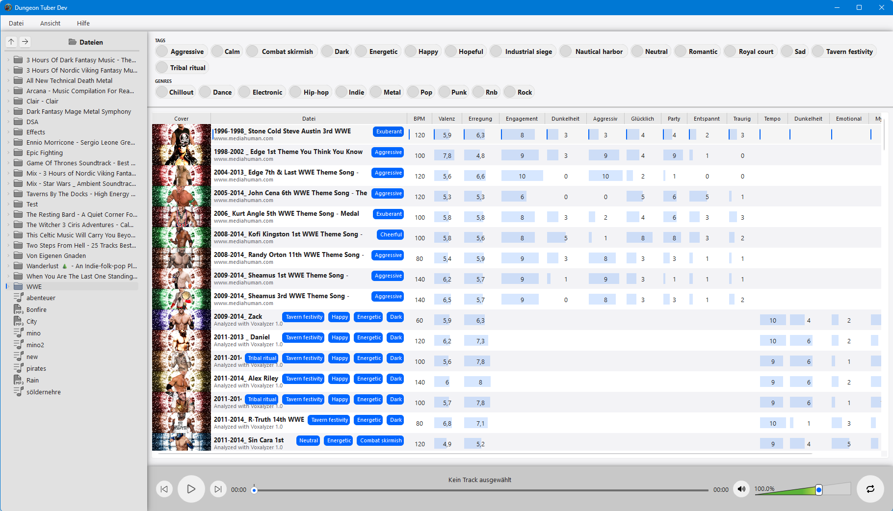

# DungeonTuber

**DungeonTuber** is a specialized music player designed for TTRPG Game Masters, streamers, and storytellers who need the perfect atmosphere at their fingertips. Unlike standard players, DungeonTuber allows you to categorize and filter your music based on emotional weight, intensity, and genre-specific metadata.



---

## 🚀 Key Features

* **Atmospheric Sliders:** Fine-tune your search using sliders for **Tempo**, **Dunkelheit** (Darkness), **Emotional**, **Mystik**, **Spannung** (Tension), and **Heroik**.
* **Gemini Integration:** Tracks are analyzed to provide objective scoring (1–10) for your music library across multiple thematic dimensions.
* **Quick-Tag Filtering:** Instant toggles for common RPG scenarios like *Emotionale*, *Kampf* (Combat), *Magisches Ritual*, and *Reise* (Travel).
* **Intuitive Library View:** See your entire collection with its associated scores and tags in a single, scannable list.

---

## 📖 Tutorial: How to Use DungeonTuber

### 1. Building Your Library
Use the **File** menu to import your audio files or navigate through the directory tree and open directories in the table below or play songs directly.
The app uses **Gemini** to scan your tracks, to use it you have to create a Gemini API Key or AI Studio Key and insert it under **Settings**.
> [!Note]
> For information how to obtain an API Key please consult the **Internet** e.g. [How to Generate Gemini API Key for Free in 2025](https://wedevs.com/blog/510096/how-to-generate-gemini-api-key/)


### 2. Filtering by Mood
The power of DungeonTuber lies in the top control panel:
* **Adjust Sliders:** Move the sliders (e.g., increase *Mystik* and *Dunkelheit* for a spooky dungeon) to filter your list for songs that match that specific "score."
* **Toggle Tags:** Click the pill-shaped buttons (like **Kampf** or **Reise**) to quickly filter for specific scene types.

### 3. Playback & Volume
* **Navigation:** Use the standard Play, Pause, and Skip buttons in the center console.
* **Progress Bar:** The waveform/timeline allows you to jump to specific moments in a track.
* **Volume Control:** Use the green wedge slider on the right to adjust audio levels smoothly.
* **Shuffle:** Click the shuffle icon to randomize the current filtered selection.

### 4. Search & Favorites
* **Search Bar:** Use the "Filter songs..." bar above the main list to find a specific track by name.
* **Starring:** Click the **Gold Star** next to any track to mark it as a favorite for quick access during your sessions.

---

## 🛠 Category Reference 

> [!IMPORTANT]
> **WIP** Final default categories may change and also can be updated by yourself under settings to fit your personal needs

| Category      | Description                                 |
|:---------------|:--------------------------------------------|
| **Tempo**      | The speed and energy of the track.          |
| **Dunkelheit** | Dark, grim, or somber tones.                |
| **Emotional**  | Emotional soft tones.                       |
| **Mystik**     | Ethereal, magical, or mysterious qualities. |
| **Spannung**   | Tension and suspense.                       |
| **Heroik**     | Epic, triumphant, and orchestral energy.    |


*Happy Adventuring!*

---

## 🛠️ Build Instructions


## Update translations:
Edit translations in _locales/**/LC_MESSAGES/DungeonTuber.po_ files and then run the following commands to update mo files. 
```bash
msgfmt -o locales/en/LC_MESSAGES/DungeonTuber.mo locales/en/LC_MESSAGES/DungeonTuber.po"
msgfmt -o locales/dn/LC_MESSAGES/DungeonTuber.mo locales/de/LC_MESSAGES/DungeonTuber.po"
```

### Using PyInstaller
```bash
pyinstaller DungeonTuber.py --windowed --icon docs/icon.ico --onefile --add-data="docs/icon.ico:icon.ico;."
```

### Using Nuitka (Recommended)
The following command uses MinGW64. If you experience slow compilation, ensure your build directory is excluded from Antivirus scanning.

```bash
python -m nuitka --mingw64 --jobs=16 DungeonTuber.py
```

*Note: The `--jobs` flag sets the number of parallel compilation jobs. Adjust based on your CPU cores.*
