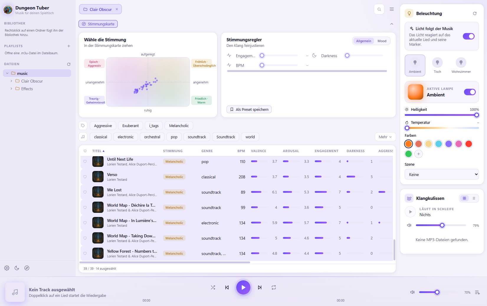

# DungeonTuber

[](https://github.com/gandulf/DungeonTuber/blob/master/README.md)
[](https://github.com/gandulf/DungeonTuber/blob/master/README.de.md)
[](https://github.com/gandulf/DungeonTuber/actions/workflows/build-app.yml)
[](https://github.com/gandulf/DungeonTuber/actions/workflows/release-app.yml)

[](https://opensource.org/licenses/MIT)

**DungeonTuber** is a self-hosted music player for Role-Playing Game Masters, streamers, and storytellers who need the perfect atmosphere at their fingertips. It runs as a small web server (a Docker container on a NAS, a Raspberry Pi or a cheap cloud VM) and plays your music **in the browser** on any device: laptop, tablet or phone at the table. Unlike standard players, DungeonTuber lets you categorize and filter your music by emotional weight, intensity, tempo and genre-specific metadata, and it can control your lights while you play.



[](https://youtu.be/85AZrB7YnOY "Watch the DungeonTuber intro on YouTube")

---

## 🚀 Key Features

* **Web app, any device:** Open the server address in a browser; playback happens in the browser (crossfade between songs, normalized volume).
* **Mood filtering:** A mood map (valence/arousal), **customizable category sliders**, BPM, genre and quick-tag filters (*Combat*, *Travel*, *Magical Ritual*, ...) narrow a large library down to the right song in seconds. Save a combination as a preset.
* **Library with scores and tags:** Songs show their scores, tags, genres, BPM, cover and chapters in one scannable table. Everything is stored in the mp3 tags, so your files stay portable.
* **Playlists and favorites:** Create `.m3u` playlists, fill them by drag and drop, mark favorites with a star.
* **Effects rack:** Layer ambient effects (rain, bonfire, ...) on top of the music; they run independently of the main player.
* **Smart lights:** Control **WiZ** bulbs from a song or chapter, even when the server runs in the cloud (see the light agent below).
* **AI analysis:** The **Voxalyzer** agent analyses your songs on a machine with the models (a GPU is recommended) and writes categories, tags, genres and BPM into the library.
* **Several users:** The administrator adds users with their own name and password; uploads are attributed to their uploader.
* **Local folders or S3:** Keep the music on the server's disk or in an S3 compatible bucket (AWS S3, Cloudflare R2, Backblaze B2, MinIO, ...).
* **English and German, light and dark theme.**

---

## 🌐 Quick Start

The easiest way is the Docker image:

```bash
docker run -d -p 8765:8765 -e DT_PASSWORD=change-me \
  -v /path/to/music:/music -v dungeontuber-data:/data ghcr.io/gandulf/dungeontuber
```

Open `http://<server>:8765` and sign in as `admin` with the password you set. Drop mp3 files or folders on the file tree to upload them, or copy them into the music folder and choose *Rescan Library* in the menu.

For access over the internet use [`deploy/docker-compose.yml`](deploy/docker-compose.yml) (automatic HTTPS with Caddy) or follow the step-by-step guide for a free Oracle Cloud VM with a DuckDNS name: [`deploy/oracle`](deploy/oracle/README.md). Details for all variants are in [Installation & Deployment](#-installation--deployment).

---

## 📖 Tutorial: How to Use DungeonTuber

### 1. Building Your Library
* **Upload:** Drag mp3 files or whole folders onto the file tree, or use *Upload songs…* in the menu or the context menu of a folder. Folder structures are kept.
* **Existing music:** Copy files into the library folder of the server (or add an S3 bucket under **Settings → Library**) and choose *Rescan Library*.
* **Analysis:** If a Voxalyzer agent is connected (see [Agents](#-agents)), choose *Analyze* on a song or folder. Without an agent the analysis functions are disabled.

### 2. Filtering by Mood
The power of DungeonTuber lies in the filter panel above the song table:
* **Mood map:** Drag the blue dot toward *Angry/Excited* for a boss fight or toward *Happy/Relaxed* for a peaceful town.
* **Category sliders:** Fine-tune the search (e.g., increase *Mystik* and *Darkness* for a spooky dungeon); the list filters automatically.
* **BPM:** Match the heartbeat of the scene, e.g. a high BPM for a chase.
* **Tags and genres:** One-click filters like **Drums** or **Dark**. Drag a tag or genre onto a song to add it.
* **Presets:** Type a name (like *Epic Boss*), click the save icon and recall the exact filter later from the dropdown.

### 3. Playback & Effects
* **Play:** Double-click a song or use the player bar (also `Ctrl`+`P` play/pause, `Ctrl`+`N` next, `Ctrl`+`B` previous). Songs crossfade and are played at a normalized volume (configurable under **Settings → Player**).
* **Shuffle & repeat:** Shuffle randomizes the current filtered selection.
* **Chapters and lights:** Songs can have chapters, and a song or chapter can carry its own light setting.
* **Effects:** Open a folder with effect sounds in the effects rack and click an effect to start it. Effects run next to the music, e.g. *Rain* under a *Tavern* song.
* **Layout:** The view menu hides the widgets you do not need, so a small screen can show just the track list.

### 4. Search, Favorites & Playlists
* **Search:** Start typing to filter the song table.
* **Favorites:** Click the **star** next to a track. Favorite folders appear in the sidebar.
* **Playlists:** *New Playlist…* creates an `.m3u` file in the folder of your choice; add songs from the context menu or by drag and drop.

---

## 🤖 Agents

Agents are small programs on other machines that connect *out* to your server, so the server itself can run anywhere. Every user creates their own agent token in **Settings → Agents**; it is shown once, and the server only keeps a hash. Tokens can be deleted again (the agents using them are disconnected); the SuperAdmin sees and can delete all tokens. Connected agents are listed there and can be removed by the SuperAdmin.

| Agent | Where it runs | What it does |
|---|---|---|
| **WiZ light agent** ([`agents/wiz`](agents/wiz/README.md)) | In the network of your WiZ bulbs | Discovers the bulbs and sends light commands over the connection, because a cloud server cannot reach the bulbs by UDP. |
| **Voxalyzer** ([`agents/voxalyzer`](agents/voxalyzer/README.md)) | On a machine with the models, ideally a GPU | Downloads songs from the server, analyses them and returns categories, tags, genres and BPM. |

```bash
dt-wiz-agent --token <token> --server https://music.example.com
voxalyzer    --token <token> --server https://music.example.com
```
Both are available as Windows executables on the [releases page](https://github.com/gandulf/DungeonTuber/releases); Voxalyzer is also a Docker image (`ghcr.io/gandulf/dungeontuber-voxalyzer`). The analysis models are downloaded on the first start.

**Several agents on one machine:** click **Download agents.json** after creating the token and put the file next to the agent programs; all agents read their server and token from it and start without arguments, and `start-agents.cmd` (attached to every release) starts them together on Windows. See [`agents/README.md`](agents/README.md).

---

## 🛠 Category Reference 

> [!IMPORTANT]
> **WIP** Final default categories may change and also can be updated by yourself under settings to fit your personal needs

| Feature | Model Usage & Acoustic Description |
| :--- | :--- |
| **Valence** | The **emotional positivity** of a track. High valence sounds happy/cheerful; low valence sounds sad or angry. |
| **Arousal** | The **intensity and energy** level. High arousal is frantic and loud; low arousal is calm, quiet, or sleepy. |
| **Engagement** | The degree to which the music captures attention, typically driven by **rhythmic stability** and "danceability." |
| **Darkness** | Indicates **low-frequency density** and minor-key tonality; associated with somber or grim atmospheres. |
| **Aggressive** | High-intensity sound featuring **distortion**, fast transients, and heavy percussive "attack." |
| **Happy** | Predicts bright, **major-key tonality** and upbeat rhythmic patterns. |
| **Party** | Designed for dancing; characterized by **heavy bass**, steady beats, and high rhythmic energy. |
| **Relaxed** | Characterized by a **low dynamic range**, slower tempos, and soft, mellow timbral qualities. |
| **Sad** | Low valence and low energy; associated with **melancholic** melodies and slower, somber pacing. |

*Happy Adventuring!*

---

## 🧠 AI Analysis Details

> [!Note]
> AI API calls to public models were removed in favor of the local analyzer (Voxalyzer). Analysis only runs through a connected Voxalyzer agent.

The server hands each song to the Voxalyzer agent, which analyses it with local models and returns categories, tags, genres and BPM. The server stores them in the mp3 tags. The agent works on one song at a time. To analyze a huge library without a server, have a look at the side project [Voxalyzer](https://github.com/gandulf/Voxalyzer).

---

## 📥 Installation & Deployment

DungeonTuber is a Python server with a web frontend. Pick the variant that fits:

| You want… | Use |
|---|---|
| An always-on server (NAS, Raspberry Pi, VPS, cloud VM) | **Docker image** `ghcr.io/gandulf/dungeontuber` |
| Run it on any machine with Python 3.12 | **Python package** – the wheel from the [releases](https://github.com/gandulf/DungeonTuber/releases) |
| Play on a single Windows PC without a server | **Desktop app** – the Windows installer from the releases |

### Docker
```bash
docker run -d -p 8765:8765 -e DT_PASSWORD=change-me \
  -v /path/to/music:/music -v dungeontuber-data:/data ghcr.io/gandulf/dungeontuber
```
[`deploy/docker-compose.yml`](deploy/docker-compose.yml) adds automatic HTTPS with Caddy for access over the internet; [`deploy/oracle`](deploy/oracle/README.md) describes a free Oracle Cloud VM with DuckDNS. Run a single server container: it keeps the analysis queue, lights and live updates in memory.

WiZ bulbs are discovered via UDP broadcast, which only works inside the bulbs' network. A server in the cloud (or a container without `network_mode: host` on Linux) therefore uses the [WiZ light agent](agents/wiz/README.md) next to the bulbs.

### Python package
```bash
pipx install dungeontuber-<version>-py3-none-any.whl
DT_PASSWORD=change-me DT_LIBRARY=/srv/music dungeontuber-server --host 0.0.0.0
```
See [`deploy/dungeontuber.service`](deploy/dungeontuber.service) for a systemd unit.

### Desktop app (optional)
The Windows installer starts the same server inside a window; only this computer can connect. To let tablets or phones at the table join, set a password and enable **Settings → Security → Share on network**, restart the app and open the shown address on the other device.

> [!Tip]
> You will probably get the blue "Windows Smart Screen Notification" once you run the installer, this is because I do not _(yet)_ have a valid signature to sign the installer. Just click on *"More Info"* and then *"Run anyway"*.

### Server configuration
Options can be passed as arguments (`dungeontuber-server --help`) or environment variables:

| Variable | Meaning | Default |
|---|---|---|
| `DT_HOST` / `DT_PORT` | interface and port | `127.0.0.1` / `8765` (the Docker image uses `0.0.0.0`) |
| `DT_DATA_DIR` | `settings.json`, `library.db`, logs | `%APPDATA%/DungeonTuber` or `~/.config/DungeonTuber` (Docker: `/data`) |
| `DT_YT_PROXY` | Default proxy for all yt-dlp requests (overridable in Settings > Library) | none |
| `DT_LIBRARY` | music folders (separated by `:` on Linux, `;` on Windows) | `~/Music` (Docker: `/music`) |
| `DT_PASSWORD` | SuperAdmin password, user name `admin` (without one only the server machine itself can connect) | – |
| `DT_FORWARDED_ALLOW_IPS` | reverse proxies whose `X-Forwarded-*` headers are trusted | `127.0.0.1` |
| `DT_AGENT_TOKEN` | fixed agent token (otherwise create one in Settings → Agents) | – |
| `DT_S3_BUCKET`, `DT_S3_ENDPOINT`, `DT_S3_ACCESS_KEY`, `DT_S3_SECRET_KEY`, ... | an S3 compatible library (can also be added under Settings → Library) | – |
| `DT_FAKE_LIGHTS` | `1` simulates WiZ bulbs for testing | – |

The SuperAdmin can add more users in **Settings → Security**; they sign in with their own name and password. Users cannot change server settings, and every uploaded song remembers who uploaded it (shown in the song details); users can only delete what they uploaded themselves.

Only files inside the library folders are accessible. Serve the server over HTTPS when it is reachable from the internet (the compose files do that with Caddy).

---

## 🛠️ Development & Build

```bash
pip install -e .[desktop,dev]
npm --prefix web ci
npm --prefix web run build        # writes server/static
python -m server --fake-lights    # the server on http://127.0.0.1:8765 with simulated bulbs
python DungeonTuber.py --fake     # desktop window with simulated bulbs
```
Frontend development with hot reload: `python -m server --fake-lights` and `npm --prefix web run dev` (port 5173).

### Tests
```bash
python -m pytest
npm --prefix web test
```

### Packages
* Python wheel (includes the web frontend): `python -m build --wheel`
* Docker image: `docker build -t dungeontuber .`
* Windows desktop app (lint, tests, web frontend, PyInstaller): `python build_app.py`, then `DungeonTuber.iss` with Inno Setup

Releases (`v*` tags) are built by [`release-app.yml`](.github/workflows/release-app.yml): Windows installer, Python wheel, multi-arch Docker image, and the WiZ and Voxalyzer agents (Windows executables and the Voxalyzer Docker image).

### Translations
Translations live in `core/locales/<lang>.json` (message id = English text) and are used by both the server and the
web frontend. Add new strings to every locale file.
